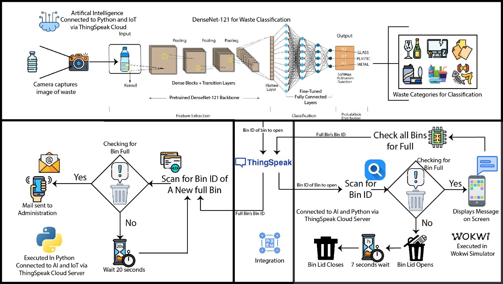

# AutoSortBin: CPS-IoT Enabled Smart Waste Management System

AutoSortBin is an intelligent waste segregation system that integrates Cyber-Physical Systems (CPS), Internet of Things (IoT), and AI. It uses a fine-tuned DenseNet-121 deep learning model for real-time classification of waste into six categories—Paper, Plastic, Glass, Metal, Organic, and E-Waste—and automates the sorting process via an ESP32-based hardware setup. The system supports real-time monitoring, actuation, and alerting, with cloud connectivity through ThingSpeak.

---

## 📌 Key Features

- 🔍 AI-powered classification using DenseNet-121 with 94.63% validation accuracy  
- 🤖 Automated bin sorting via servo motors controlled by ESP32  
- 📡 Real-time bin monitoring using ultrasonic sensors (HC-SR04)  
- 💬 LCD display for live system feedback  
- 🌐 Cloud integration via ThingSpeak for command and telemetry  
- 📧 Automatic email alerts triggered when bins are full  

---

## 📐 System Architecture

---

## 🧠 Tech Stack

| Layer         | Technology Used                                     |
|---------------|------------------------------------------------------|
| AI Inference  | DenseNet-121 (Keras + TensorFlow)                   |
| Dataset       | Custom + Kaggle (TrashNet, Garbage Classification)  |
| Cloud Comm    | ThingSpeak (REST API + Webhooks)                    |
| MCU           | ESP32 (Wokwi simulation)                            |
| Hardware      | HC-SR04 Sensors, Servo Motors, 16x2 LCD             |
| Simulation    | Wokwi IoT Simulator                                 |
| Languages     | Python (AI), C++ (ESP32 Firmware)                   |

---

## 📊 Model Performance

| Metric      | Training | Testing | Validation |
|-------------|----------|---------|------------|
| Accuracy    | 94.68%   | 94.72%  | 94.63%     |
| Precision   | 95.80%   | 95.50%  | 95.20%     |
| Recall      | 93.90%   | 94.00%  | 93.70%     |
| F1 Score    | 94.85%   | 94.74%  | 94.44%     |

> DenseNet-121 outperformed ResNet-50 and VGG-16 in both accuracy and efficiency on this task.

---

## 🛠 Setup Instructions

1. Clone the repository.  
2. Set up a Python virtual environment.  
3. Train or load the pre-trained DenseNet-121 model.  
4. Create a ThingSpeak channel with appropriate read/write API keys.  
5. Upload ESP32 firmware via Arduino IDE or test in Wokwi.  
6. Run real-time waste classification with image input or webcam.  
7. Monitor bin status, servo response, and email alert triggering.  

---

## 📦 Dataset Overview

- Sources: TrashNet (Kaggle), Garbage Classification (Kaggle), custom data  
- Classes: Paper, Plastic, Glass, Metal, Organic, E-Waste  
- Preprocessing: Resize (224x224), normalize to [0,1], Gaussian Blur, augmentation (flip, rotate, zoom)  
- Format: One-hot encoded labels, split: 70% train / 15% test / 15% validation  

---

## 🚀 Future Enhancements

- Local inference on edge devices (Jetson Nano / Raspberry Pi)  
- Replace ThingSpeak with AWS IoT Core or Azure IoT Hub  
- Add a central web dashboard and admin panel  
- Extend to multi-label waste types (e.g. composite or hazardous waste)  
- Upgrade distance sensors to LIDAR for outdoor use  

---

## 👤 Maintainer

- [@COSMIC_ATOM](https://github.com/forhimankgupta)

---

## 📄 License

This project is licensed under the MIT License.

